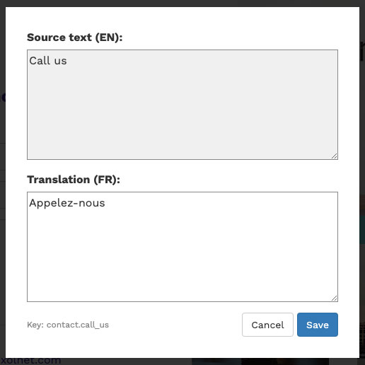

# Laravel Translation Editor

[](https://packagist.org/packages/eXolnet/laravel-translation-editor)
[](LICENSE)
[](https://github.com/eXolnet/laravel-translation-editor/actions?query=workflow%3Atests)
[](https://packagist.org/packages/eXolnet/laravel-translation-editor)

This project allow you to edit your translations directly through the browser and the command line.

## Installation

Require this package with composer:

```
composer require exolnet/laravel-translation-editor
```

The translation editor will be enabled when the environment variable ``TRANSLATION_EDITOR_ENABLED`` is ``true``.

If you don't use package auto-discovery, add the service provider to the ``providers`` array in `config/app.php`:

```
Exolnet\Translation\Editor\TranslationEditorServiceProvider::class
```

## Usage

### In-app translating

In your development environment, you can enable in-app translation by adding to your `.env` the following
environment variable:

```
TRANSLATION_EDITOR_ENABLED=true
```

You'll then be able to open the editor with `alt + click` on all translations using `te` or `@te` helpers:

```html
<h1>@te('home.title')</h1>

<!-- OR -->

<h1>{{ te('home.title') }}</h1>
``` 

And the editor looks like this:



Once saved, you can commit the edited translation files in `resources/lang/**/*.php` if you're satisfied.

### Detect potential translations

You can detect most of your potential variable string with the `i18n:detect` command. To do so, simply run 
``` bash
php artisan i18n:detect
```
By default this command will go through all your `.php` files in the views directory and look for potential variables. 
Every time a string is detected, it will ask you if you want to save it and you will have to provide a name 
for your variable.

Additionally, you can provide the `--locale` or `-l` option if you want to save the detected variable in another language 
than the default one in your Laravel configuration.

## Testing

To run the phpUnit tests, please use:

``` bash
composer test
```

## Contributing

Please see [CONTRIBUTING](CONTRIBUTING.md) and [CODE OF CONDUCT](CODE_OF_CONDUCT.md) for details.

## Security

If you discover any security related issues, please email security@exolnet.com instead of using the issue tracker.

## Credits

- [Alexandre D'Eschambeault](https://github.com/xel1045)
- [Maxime Mongeau](https://github.com/maxador)
- [All Contributors](../../contributors)

## License

Copyright © [eXolnet](https://www.exolnet.com). All rights reserved.

This code is licensed under the [MIT license](http://choosealicense.com/licenses/mit/).
Please see the [license file](LICENSE) for more information.
